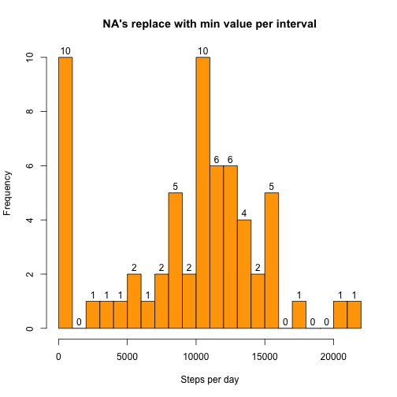

###Loading and preprocessing the data  

Show any code that is needed to  
1. Load the data (i.e. read.csv())  
2. Process/transform the data (if necessary) into a format suitable for your analysis  


```r
acs<-read.csv("activity.csv", header=TRUE, stringsAsFactors=FALSE, na.strings="NA")
head(acs,2)
```

```
##   steps       date interval
## 1    NA 2012-10-01        0
## 2    NA 2012-10-01        5
```

```r
acs$date <- as.Date(acs$date , format ="%Y-%m-%d")
acs$steps <- as.numeric(acs$steps)
summary(acs)
```

```
##      steps             date               interval     
##  Min.   :  0.00   Min.   :2012-10-01   Min.   :   0.0  
##  1st Qu.:  0.00   1st Qu.:2012-10-16   1st Qu.: 588.8  
##  Median :  0.00   Median :2012-10-31   Median :1177.5  
##  Mean   : 37.38   Mean   :2012-10-31   Mean   :1177.5  
##  3rd Qu.: 12.00   3rd Qu.:2012-11-15   3rd Qu.:1766.2  
##  Max.   :806.00   Max.   :2012-11-30   Max.   :2355.0  
##  NA's   :2304
```

###What is mean total number of steps taken per day?  

For this part of the assignment, you can ignore the missing values in the dataset.  
1. Make a histogram of the total number of steps taken each day  
2. Calculate and report the mean and median total number of steps taken per day  


```r
library(base)
dataSteps <- data.frame(aggregate(acs[,1], list(activityDate = acs[,2]), sum, na.rm=TRUE))
head(dataSteps,2)
```

```
##   activityDate   x
## 1   2012-10-01   0
## 2   2012-10-02 126
```

```r
par(mar=c(2,2,5,0),mgp=c(5,1,0))
hist(dataSteps[,2],col="orange", labels=TRUE, main="Total number of steps taken each day", breaks=25, xlab="Steps per day")
```

 

####Mean of total steps taken per day

```r
mean(dataSteps[,2])
```

```
## [1] 9354.23
```


####Median of total steps taken per day

```r
median(dataSteps[,2])
```

```
## [1] 10395
```

###What is the average daily activity pattern?

1. Make a time series plot (i.e. type = "l") of the 5-minute interval (x-axis) and the average number of steps taken, averaged across all days (y-axis)  
  

```r
library(ggplot2)
dataInterval<-aggregate(acs[,1], list(Intervals=acs[,3]), sum, na.rm=TRUE)
head(dataInterval,3)
```

```
##   Intervals  x
## 1         0 91
## 2         5 18
## 3        10  7
```

```r
par(mar=c(5,5,5,5))
qplot(dataInterval$Intervals,dataInterval$x,  data=dataInterval, geom=c("line"), xlab="Steps Per Interval", ylab="Total Steps",main="Total number of steps per interval")
```

 

2. Which 5-minute interval, on average across all the days in the dataset, contains the maximum number of steps?

```r
maxN<-max(dataInterval$x)
dataInterval[dataInterval$x==maxN,]
```

```
##     Intervals     x
## 104       835 10927
```

###Imputing missing values

Note that there are a number of days/intervals where there are missing values (coded as NA). The presence of missing days may introduce bias into some calculations or summaries of the data.  

1. Calculate and report the total number of missing values in the dataset (i.e. the total number of rows with NAs)

```r
nrow(acs[is.na(acs),])
```

```
## [1] 2304
```
2. Devise a strategy for filling in all of the missing values in the dataset. The strategy does not need to be sophisticated. For example, you could use the mean/median for that day, or the mean for that 5-minute interval, etc.  

**If I use the min for that 5-minute interval tofill in the NA's - due to the fact that the value is missing I can only assume the minimum impact- the values are the same as the initial data frame. There are no difference in the histograms. But if we replace it with the mean/median value of that 5-min interval the histograms are different - in the new one, with no missing values we have little concentration of values towards 0 value of axis **


```r
dataIntervalMins<-aggregate(acs[,1], list(Intervals=acs[,3]), min,na.rm=TRUE)
summary(dataIntervalMins)
```

```
##    Intervals            x    
##  Min.   :   0.0   Min.   :0  
##  1st Qu.: 588.8   1st Qu.:0  
##  Median :1177.5   Median :0  
##  Mean   :1177.5   Mean   :0  
##  3rd Qu.:1766.2   3rd Qu.:0  
##  Max.   :2355.0   Max.   :0
```

```r
dataIntervalMean<-aggregate(acs[,1], list(Intervals=acs[,3]), mean,na.rm=TRUE)
summary(dataIntervalMean)
```

```
##    Intervals            x          
##  Min.   :   0.0   Min.   :  0.000  
##  1st Qu.: 588.8   1st Qu.:  2.486  
##  Median :1177.5   Median : 34.113  
##  Mean   :1177.5   Mean   : 37.383  
##  3rd Qu.:1766.2   3rd Qu.: 52.835  
##  Max.   :2355.0   Max.   :206.170
```

3. Create a new dataset that is equal to the original dataset but with the missing data filled in.  


```r
acsWthOutNA<-acs
head(acsWthOutNA,2)
```

```
##   steps       date interval
## 1    NA 2012-10-01        0
## 2    NA 2012-10-01        5
```

```r
newData<-function(data, intervals)
{
      for(i in 1:nrow(data))
            if(is.na(data[i,1]))
               {                              
                  value<-subset(intervals,intervals$Intervals == data[i,3])$x
                  data[i,1]<-value
               }
      data$steps <-as.integer(data$steps)
      newData<-data
}
dt<-newData(acsWthOutNA,dataIntervalMins) 
summary(dt)
```

```
##      steps             date               interval     
##  Min.   :  0.00   Min.   :2012-10-01   Min.   :   0.0  
##  1st Qu.:  0.00   1st Qu.:2012-10-16   1st Qu.: 588.8  
##  Median :  0.00   Median :2012-10-31   Median :1177.5  
##  Mean   : 32.48   Mean   :2012-10-31   Mean   :1177.5  
##  3rd Qu.:  0.00   3rd Qu.:2012-11-15   3rd Qu.:1766.2  
##  Max.   :806.00   Max.   :2012-11-30   Max.   :2355.0
```

```r
dtMean<-newData(acsWthOutNA,dataIntervalMean) 
summary(dtMean)
```

```
##      steps             date               interval     
##  Min.   :  0.00   Min.   :2012-10-01   Min.   :   0.0  
##  1st Qu.:  0.00   1st Qu.:2012-10-16   1st Qu.: 588.8  
##  Median :  0.00   Median :2012-10-31   Median :1177.5  
##  Mean   : 37.33   Mean   :2012-10-31   Mean   :1177.5  
##  3rd Qu.: 27.00   3rd Qu.:2012-11-15   3rd Qu.:1766.2  
##  Max.   :806.00   Max.   :2012-11-30   Max.   :2355.0
```

4. Make a histogram of the total number of steps taken each day and Calculate and report the mean and median total number of steps taken per day. Do these values differ from the estimates from the first part of the assignment? What is the impact of imputing missing data on the estimates of the total daily number of steps?


```r
dtAggr<-data.frame(aggregate(dt[,1], list(activityDate = dt[,2]), sum, na.rm=TRUE))
hist(dtAggr[,2],col="orange", labels=TRUE,breaks=25, main="NA's replace with min value per interval", xlab="Steps per day")
```

 

```r
dtAggrMean<-data.frame(aggregate(dtMean[,1], list(activityDate = dtMean[,2]), sum, na.rm=TRUE))
hist(dtAggrMean[,2],col="orange", labels=TRUE,breaks=25, main="NA's replace with mean value per interval", xlab="Steps per day")
```

 

Mean of the new dataset - first for the dataset where NA's were replaced with min value, second for the dataset where NA's were replaced with mean value.

```r
mean(dtAggr[,2])
```

```
## [1] 9354.23
```

```r
mean(dtAggrMean[,2])
```

```
## [1] 10749.77
```

Median of the new dataset  - first for the dataset where NA's were replaced with min value, second for the dataset where NA's were replaced with mean value.

```r
median(dtAggr[,2])
```

```
## [1] 10395
```

```r
median(dtAggrMean[,2])
```

```
## [1] 10641
```

**Value for mean and median are a lot higher when using mean for NA's.**

###Are there differences in activity patterns between weekdays and weekends?

For this part the weekdays() function may be of some help here. Use the dataset with the filled-in missing values for this part.  
1. Create a new factor variable in the dataset with two levels -- "weekday" and "weekend" indicating whether a given date is a weekday or weekend day. 


```r
days<-function(dt)
      {      
            dt$day<-weekdays(dt$date)
            for(i in 1:nrow(dt))
                  if(dt[i,4]=="Saturday" || dt[i,4]=="Sunday")
                        dt[i,4]<-"weekend"
                  else  dt[i,4]<-"weekday"
            dt
      }
dtWeekDays<-days(dtMean)
head(dtWeekDays,2)
```

```
##   steps       date interval     day
## 1     1 2012-10-01        0 weekday
## 2     0 2012-10-01        5 weekday
```

2. Make a panel plot containing a time series plot (i.e. type = "l") of the 5-minute interval (x-axis) and the average number of steps taken, averaged across all weekday days or weekend days (y-axis).   

```r
qplot(dtWeekDays$interval,dtWeekDays$steps, data=dtWeekDays, facets= day~., geom="line", xlab="Interval", ylab="Total Steps")
```

 

**More peeks on weekends. More of a constant frequency in weekdays.**

